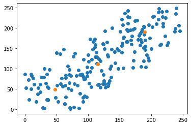

# KMeans_clustering
On made-up data, it's a clustering warm-up project using the kmeans clustering method. 
----------------
I wrote the code that takes 2D data and outputs the best coordinates for each centroid based on the number of centroids provided.
Finally, the results will be compared to sklearn.clustering.kmeans outputs.
----------------
You can see an example. of an output on x,y data here:
 

